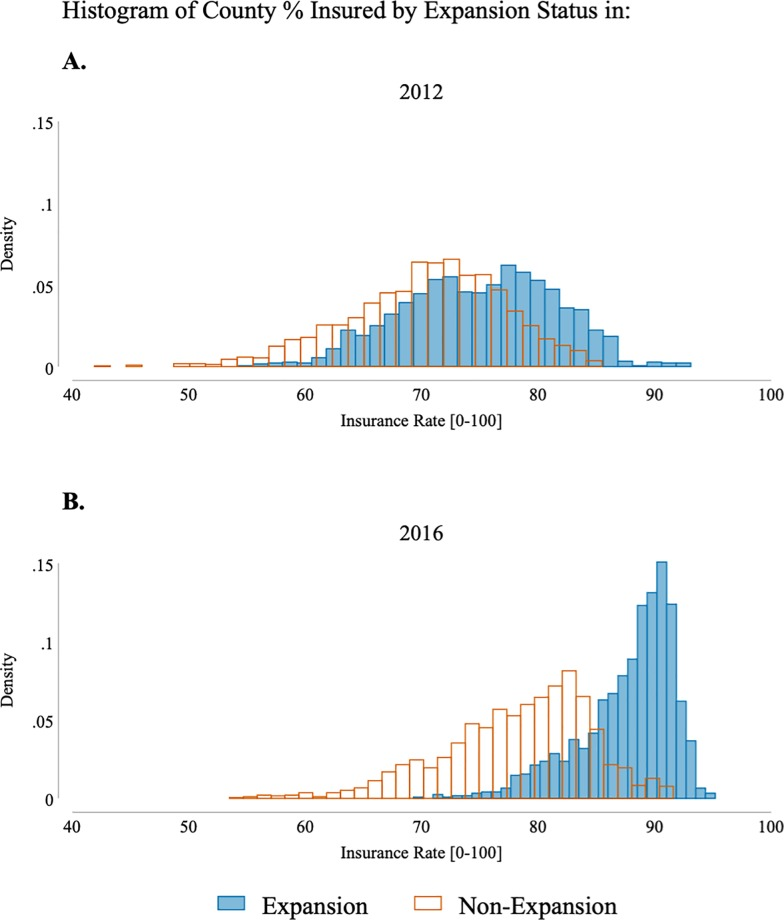
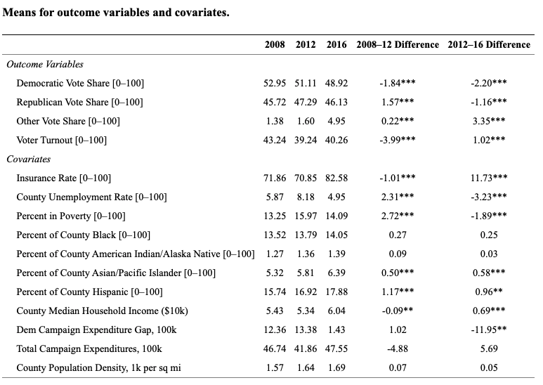
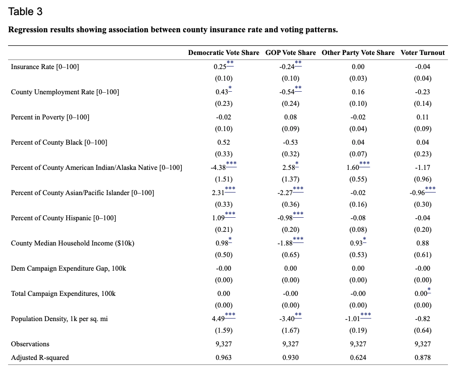

```{r setup, include=FALSE}
knitr::opts_chunk$set(
	echo = TRUE,
	warning = TRUE,
	message = TRUE,
	comment = "##",
	prompt = FALSE,
	tidy = TRUE,
	tidy.opts = list(blank = FALSE, width.cutoff = 75),
	fig.path = "img/",
	fig.align = "center"
)
```

```{r}
library(tidyverse)
# need haven, kable, kableExtra, cowplot, estimatr installed.
```


## Introduction

The paper i am reanalyzing data from wants to test whether changes in health insurance coverage at a county level correlate with changes in party line voting in the 2008, 2012, 2016 elections. The data on county election results come from the Guardian newpaper and Townhall. Data for county-level insurance rates comes from Small Area Health Insurance Estimates, and county-level income and poverty rates come from the Small Area Income and Poverty Estimates. County unemployment rates are from the Bureau of Labor Statistics, and county-level
populations by race and ethnicity are from the National Cancer Institute’s Surveillance, Epidemiology, and End Results Program. After running a least squares regression, they found that increase in insurance coverage was associated with a significant increase in vote share at the expense of the GOP party. They also found that in states that had Medicaid expansion there was no significant differential effect compared to those that did not. From this, they concluded that health insurance markets played a role in the outcome of the 2016 election. 


## Visualization of Data
```{r}
# reads in data file using haven's function read_dta
mydata <- haven::read_dta("election_panel_2008_2016.dta")
# glimpse data. arranged by state so there are fewer NA values to peek at
mydata %>% arrange(state) %>% glimpse
```


```{r, message=FALSE, warning = FALSE}
# create 2012 histogram density of insurance rates
hist2012 <- mydata %>% filter(year == 2012) %>%
  ggplot(aes(x = pctic_0400, 
             after_stat(density),  # makes histogram a density histogram
             group = expansion,  
             fill = factor(expansion), # separates into the two expansion groups
             color = factor(expansion))) + 
  geom_histogram(position="identity", bins = 40) + 
  scale_color_manual(values=c("darkorange1", "deepskyblue4"), 
                     labels = c("Non-Expansion", "Expansion")) + 
  scale_fill_manual(values=c("orange1", "#E69F0000"), 
                    labels = c("Non-Expansion", "Expansion")) + 
  xlim(40, 100) + 
  ylim(0, .15) + 
  xlab("Insurance Rate [0-100]") +
  ggtitle("2012") +
  theme(legend.title = element_blank())

# same histogram as above with year 2016
hist2016 <- mydata %>% filter(year == 2016) %>%
  ggplot(aes(x = pctic_0400, 
             after_stat(density), 
             group = expansion, 
             fill = factor(expansion), 
             color = factor(expansion))) + 
  geom_histogram(position="identity", bins = 55) + 
  scale_color_manual(values=c("darkorange1", "deepskyblue4"), 
                     labels = c("Non-Expansion", "Expansion")) + 
  scale_fill_manual(values=c("orange1", "#E69F0000"), 
                    labels = c("Non-Expansion", "Expansion")) + 
  xlim(40, 100) + 
  ylim(0, .15) + 
  xlab("Insurance Rate [0-100]") +
  ggtitle("2016") +
  theme(legend.title = element_blank())


# combines the two histograms into one image
cowplot::plot_grid(hist2012, 
                   hist2016, 
                   nrow = 2, 
                   labels = c("A", "B"))
```

The above plots replicate the original plots below from the paper




## Replications/Reanalysis

This replication is replicating Table 1 in the paper. 
The table below provides provides population-weighted means of the variables in the regression model
```{r}
# empty data frome to attach results from regresions
results <- data.frame()

# each of these variables are being regressed on by year. 
vars <- c("voteshare_dem", 
          "voteshare_gop", 
          "voteshare_oth", 
          "turnout",
          "pctic_0400",
          "unemp_rate_cty",
          "percent_in_poverty",
          "perc_black",
          "perc_native",
          "perc_asian",
          "perc_hisp",
          "median_income",
          "dem_campaign_spending_gap",
          "total_campaign_spending",
          "pop_den_100k")

# this loop is applied to every variable needed 
for(var in vars) {
  tmp <- mydata %>%
    mutate(applied = mydata[[var]]) %>% # identifies a column that the model will the regressed on 
    filter(!is.na(pop_total)) %>% # removes NA values for county population totals
    filter(!is.na(applied)) %>% # removes NA values for appleid variable
    group_by(year) %>% # groups by year
    summarise(mean = weighted.mean(applied, pop_total)) # creates weighted mean for each year

  # extracts mean for specific year  
  y08 <- filter(tmp, year == 2008)$mean 
  y12 <- filter(tmp, year == 2012)$mean
  y16 <- filter(tmp, year == 2016)$mean
  
  # extracts p value of a weighted regression between years 2008 and 2012
  p0812 <- mydata  %>% 
    filter(year == 2008 | year == 2012) %>% 
    mutate(applied = .[[var]]) %>% 
    lm(applied ~ year, data = ., weights = pop_total) %>% 
    summary %>% coef  %>% .["year", "Pr(>|t|)"]
  
  # extracts p value of a weighted regression between years 2012 and 2016
  p1216 <- mydata  %>% 
    filter(year == 2012 | year == 2016) %>% 
    mutate(applied = .[[var]]) %>% 
    lm(applied ~ year, data = ., weights = pop_total) %>% 
    summary %>% coef %>% .["year", "Pr(>|t|)"]
  
  # creates temporary data frome to put together all necessary variables
  tmp <- data.frame(var, y08, y12, y16, y12-y08, y16-y12, p0812, p1216)
  
  # binds the temporary data frame to the results data frame 
  results <- rbind(results, tmp)
}

# formats necessary columns to round to the second digit
results$y08 <- round(results$y08, digits = 2)
results$y12 <- round(results$y12, digits = 2)
results$y16 <- round(results$y16, digits = 2)
results$y12...y08 <- round(results$y12...y08, digits = 2)
results$y16...y12 <- round(results$y16...y12, digits = 2)

# adds appropriate number of "*" to the 2008-2012 means based on p-value
for (i in 1:15) {
  y12...y08 <- as.character(results[i, "y12...y08"])
  # three "*" if p value less than .01
  if (results[i, "p0812"] < 0.01) {
    y12...y08 <- paste(y12...y08, "***")
  } 
  # two "*" if p value less than .05
  else if (results[i, "p0812"] < 0.05) {
      y12...y08 <-paste(y12...y08, "**")
  } 
  # one "*" if p value less than .1
  else if (results[i, "p0812"] < 0.1) {
      y12...y08 <- paste(y12...y08, "*")
  }
  # puts the value back into the results table
  results[i, "y12...y08"] <- y12...y08
}

# does the same as above loop to 2012-2016 means
for (i in 1:15) {
  y16...y12 <- as.character(results[i, "y16...y12"])
  if (results[i, "p1216"] < 0.01) {
    y16...y12 <- paste(y16...y12, "***")
  } else if (results[i, "p1216"] < 0.05) {
      y16...y12 <-paste(y16...y12, "**")
  } else if (results[i, "p1216"] < 0.1) {
      y16...y12 <- paste(y16...y12, "*")
  }
  results[i, "y16...y12"] <- y16...y12
}

# add in subheadings for table
results <- rbind(data.frame(var = "Outcome Variables", y08 = "", 
                            y12 = "", y16 = "", 
                            y12...y08 = "", y16...y12 = "", 
                            p0812 = "", p1216 = ""), results)
results <- rbind(results[1:5,], data.frame(var = "Covariates", y08 = "", 
                            y12 = "", y16 = "", 
                            y12...y08 = "", y16...y12 = "", 
                            p0812 = "", p1216 = ""), results[6:16,])

# make a pretty table
results %>% select(-p0812, -p1216) %>% 
  knitr::kable(col.names = c("Variable", "2008", "2012", "2016", "2008–12 Difference", "2012–16 Difference"), 
               type = "html", caption = "Means for outcome variables and covariates", escape = F) %>%
  kableExtra::kable_styling() %>%
  kableExtra::column_spec(column = c(5, 6),bold=T) %>% 
  kableExtra::add_footnote(c("Means are weighted by county population",
                             "Difference between the two years is statistically significant with * p < 0.10, ** p < 0.05, *** p < 0.01"), 
                           notation = "none")
```

The original table that the above replication is based on:



This replication replicated Table 3 of the paper.
It is a least squares regression results from data at the county-level that control for county fixed-effects, year fixed-effects, and a variety of observable and time-varying county characteristics. 
```{r}
library(estimatr)
# creates democrat regression
demlm <- lm_robust(voteshare_dem ~ pctic_0400 + 
                      unemp_rate_cty +
                      percent_in_poverty +
                      perc_black +
                      perc_native +
                      perc_asian +
                      perc_hisp +
                      median_income +
                      dem_campaign_spending_gap +
                      total_campaign_spending +
                      pop_den_100k, 
          data = mydata,
          weights = pop_total, # uses county population as weight
          clusters = state, # clusters by state
          fixed_effects = ~ year + combined_fips, # fixed effects
          `se_type` = "CR0")

# same as above for gop
goplm <- lm_robust(voteshare_gop ~ pctic_0400 + 
                      unemp_rate_cty +
                      percent_in_poverty +
                      perc_black +
                      perc_native +
                      perc_asian +
                      perc_hisp +
                      median_income +
                      dem_campaign_spending_gap +
                      total_campaign_spending +
                      pop_den_100k, 
          data = mydata,
          weights = pop_total,
          clusters = state,
          fixed_effects = ~ year + combined_fips,
          `se_type` = "CR0")

# same as above for other parties
othlm <- lm_robust(voteshare_oth ~ pctic_0400 + 
                      unemp_rate_cty +
                      percent_in_poverty +
                      perc_black +
                      perc_native +
                      perc_asian +
                      perc_hisp +
                      median_income +
                      dem_campaign_spending_gap +
                      total_campaign_spending +
                      pop_den_100k, 
          data = mydata,
          weights = pop_total,
          clusters = state,
          fixed_effects = ~ year + combined_fips,
          `se_type` = "CR0")

# same as above for turnout
turnlm <- lm_robust(turnout ~ pctic_0400 + 
                      unemp_rate_cty +
                      percent_in_poverty +
                      perc_black +
                      perc_native +
                      perc_asian +
                      perc_hisp +
                      median_income +
                      dem_campaign_spending_gap +
                      total_campaign_spending +
                      pop_den_100k, 
          data = mydata,
          weights = pop_total,
          clusters = state,
          fixed_effects = ~ year + combined_fips,
          `se_type` = "CR0")

# created empty data frame to store results
results <- data.frame()

# adds estimate, std error, and p value for all 4 models
results <- rbind(results, data.frame(estoth = summary(othlm)$coefficients[,"Estimate"],
                                     erroth = summary(othlm)$coefficients[,"Std. Error"],
                                     pvaloth = summary(othlm)$coefficients[,"Pr(>|t|)"],
                                     vars = rownames(summary(othlm)$coefficients)))
results <- cbind(results, data.frame(estgop = summary(goplm)$coefficients[,"Estimate"],
                                     errgop = summary(goplm)$coefficients[,"Std. Error"],
                                     pvalgop = summary(goplm)$coefficients[,"Pr(>|t|)"]))
results <- cbind(results, data.frame(estdem = summary(demlm)$coefficients[,"Estimate"],
                                     errdem = summary(demlm)$coefficients[,"Std. Error"],
                                     pvaldem = summary(demlm)$coefficients[,"Pr(>|t|)"]))
results <- cbind(results, data.frame(estturn = summary(turnlm)$coefficients[,"Estimate"],
                                     errturn = summary(turnlm)$coefficients[,"Std. Error"],
                                     pvalturn = summary(turnlm)$coefficients[,"Pr(>|t|)"]))


# rounds estimations and std. errors
results[,1:3] <- round(results[,1:3], digits = 2)
results[,5:6] <- round(results[,5:6], digits = 2)
results[,8:9] <- round(results[,8:9], digits = 2)
results[,11:12] <- round(results[,11:12], digits = 2)

# appends appropriate numbers of "*" for p-value for all 4 models
for (i in 1:11) {
  est <- as.character(results[i, "estoth"])
    if (results[i, "pvaloth"] < 0.01) {
    est <- paste(est, "***")
  } else if (results[i, "pvaloth"] < 0.05) {
      est <-paste(est, "**")
  } else if (results[i, "pvaloth"] < 0.1) {
      est <- paste(est, "*")
  }
  est <- paste0(est, "<br>", "(", as.character(results[i, "erroth"]), ")")
  results[i, "OthShare"] <- est
}

for (i in 1:11) {
  est <- as.character(results[i, "estdem"])
    if (results[i, "pvaldem"] < 0.01) {
    est <- paste(est, "***")
  } else if (results[i, "pvaldem"] < 0.05) {
      est <-paste(est, "**")
  } else if (results[i, "pvaldem"] < 0.1) {
      est <- paste(est, "*")
  }
  est <- paste0(est, "<br>", "(", as.character(results[i, "errdem"]), ")")
  results[i, "DemShare"] <- est
}

for (i in 1:11) {
  est <- as.character(results[i, "estgop"])
    if (results[i, "pvalgop"] < 0.01) {
    est <- paste(est, "***")
  } else if (results[i, "pvalgop"] < 0.05) {
      est <-paste(est, "**")
  } else if (results[i, "pvalgop"] < 0.1) {
      est <- paste(est, "*")
  }
  est <- paste0(est, "<br>", "(", as.character(results[i, "errgop"]), ")")
  results[i, "GOPShare"] <- est
}

for (i in 1:11) {
  est <- as.character(results[i, "estturn"])
    if (results[i, "pvalturn"] < 0.01) {
    est <- paste(est, "***")
  } else if (results[i, "pvalturn"] < 0.05) {
      est <-paste(est, "**")
  } else if (results[i, "pvalturn"] < 0.1) {
      est <- paste(est, "*")
  }
  est <- paste0(est, "<br>", "(", as.character(results[i, "errturn"]), ")")
  results[i, "Turn"] <- est
}


# create temporary table to append number of obervations
tmp <- data.frame(estoth= "", erroth = "", pvaloth = "",
                                     vars = "Observations",
                                     estgop = "", errgop = "", pvalgop = "",
                                     estdem = "", errdem = "", pvaldem = "",
                                     estturn = "", errturn = "", pvalturn = "",
                                     OthShare = nobs(othlm),
                                     DemShare = nobs(demlm),
                                     GOPShare = nobs(goplm),
                                     Turn = nobs(turnlm))
results <- rbind(results, tmp)

# create temporary table to append r-squared values
tmp <- data.frame(estoth= "", erroth = "", pvaloth = "",
                                     vars = " Adjusted R-Squared",
                                     estgop = "", errgop = "", pvalgop = "",
                                     estdem = "", errdem = "", pvaldem = "",
                                     estturn = "", errturn = "", pvalturn = "",
                                     OthShare = round(summary(othlm)$adj.r.squared, digits = 3),
                                     DemShare = round(summary(demlm)$adj.r.squared, digits = 3),
                                     GOPShare = round(summary(goplm)$adj.r.squared, digits = 3),
                                     Turn = round(summary(turnlm)$adj.r.squared, digits = 3))
results <- rbind(results, tmp)


# makes table pretty
results %>% 
  select("vars", "DemShare", "GOPShare", "OthShare", "Turn") %>% 
  knitr::kable("html", escape = F, row.names = F, col.names = c("Variable", "Democratic Vote Share", "GOP Vote Share", "Other Party Vote Share", "Voter Turnout")) %>% 
  kableExtra::kable_styling() %>% 
  kableExtra::add_footnote(c("The regression is a weighted-least squares specification that also includes year fixed-effects and county fixed-effects. Standard errors are clustered at the state-level, and the regression is weighted by county population.",
                             "* p < 0.10, ** p < 0.05, *** p < 0.01"), 
                           notation = "none")

detach(package:estimatr)
```


The original table that the above replication is based on:


## Summary/Discussion

The first replication (the histogram) was one if the simplest replications. I had a bit of trouble figuring out how to make the histogram a density histogram, but was able to land on <code>after_stat(density)</code>. Additionally, it took a bit of trial and error to get the right number of bins for each of the plots. 
The second replication give me a big headache for a while. For one, it was a bit strange that they performed a regression rather than doing a paired t-test. It took quite a while for me to figure out that they were conducting a
_weighted_ linear regression. Additionally, it was a huge headache that they performed a regresssion on each individual regression (meaning I had to run a loop 15 times for each variable) rather than adding each variable as a fixed effect. 
The third replication was interesting because of how many attributes of the regression there there. Not only was it weighted by population, it was clustered by state and had two fixed effects. The differences between the original regression and mine are small, but point out some interesting changes (though they don't necessarily change the outcome of the conclusion). The original regression had no significance in change of percent of black voters in GOP vote share, but mine had a small significance (p < .1). All other differences (mostly the standard error) are differnt by less than a tenth and do not effect and changein significances. These differences are likely due to the way the standard error is calculated. I had assumed that becuase the original authors used stata for their analysis, the se type would be stata (cluster result 1), but when I ran my regression as stata, my results were much less significant than theirs. The closest to their results was cluster result 0, so that is what is in the results above.

## References